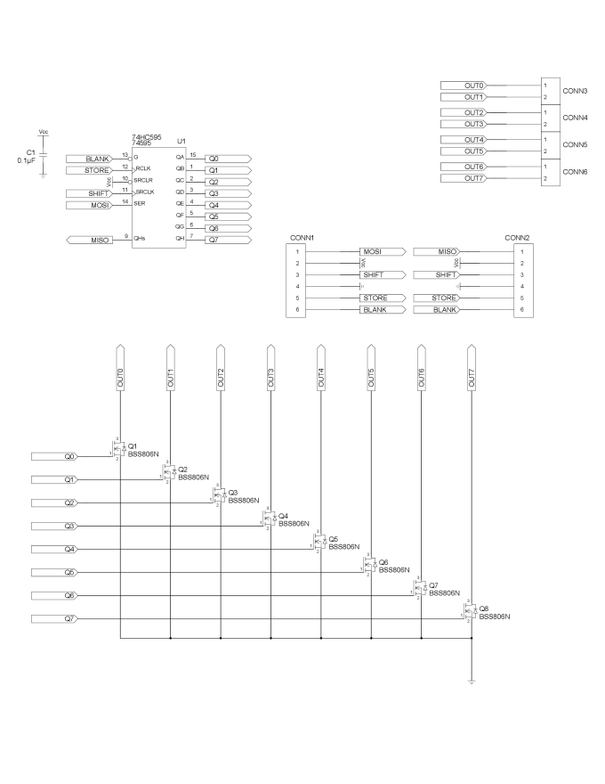
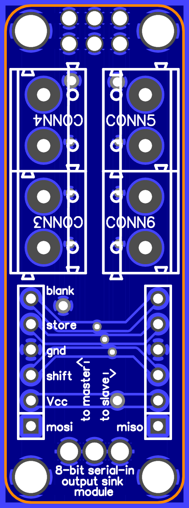
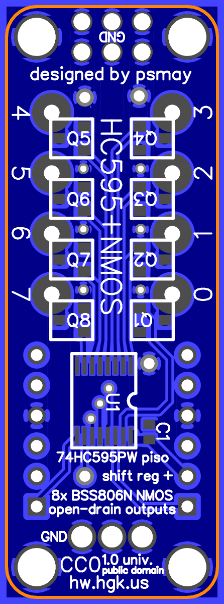

74HC595PW SIPO shift register with added N-channel MOSFET outputs and screw terminals
=====================================================================================

This is a design for an augmented breakout for a 74HC595
serial-in/parallel-out 8-bit shift register, in a TSSOP-16 package
(specifically, 74HC595PW), with added N-channel MOSFETs (BSS806N or
similar) in SOT-23 packages, and 5.08mm-pitch output screw terminals.

Features
--------

*   Decoupling capacitor on board.
*   N-channel open-drain outputs: The outputs are not run directly from
    the 74HC595 pins but via an N-channel MOSFET gated by each pin. The
    outputs are thus sink-only but can handle greater voltage and
    current depending on the MOSFETs used.
*   5.08mm-pitch screw terminals for outputs.
*   No terminal is included for a power ground connection. However,
    plated vias are provided at the ends of the board, including a row
    of three at one end suitable for 14AWG wire, and a 3x2 arrangement
    at 0.1in pitch on the other end which can be used for header pins,
    PCB-mount quick-disconnect tabs, or arbitrary other through-hole
    components, or even another screw terminal.
    *   If the corner mounting holes will be used, make sure not to
        install hardware that will obstruct the holes or screw heads.
*   The host-side 6-pin header provides power, serial, and blanking
    inputs to the board, while the compatible guest-side 6-pin header
    provides serial outputs and passed-through power and blanking
    outputs to the host-side header of another breakout (or to another
    74HC595-based or similar assembly).
*   Pre-fab and some-assembly-required options for cables for the header
    connectors are readily available.

Parts list
----------

*   1 x 74HC595PW (TSSOP-16)
*   8 x N-channel MOSFET (SOT-23, pins in GSD order) e.g. BSS806N,
    2N7002P
    *   Many different MOSFETs with distinct capabilities are available
        that fit this description. Determine the output requirements for
        your application and select the MOSFET accordingly.
*   2 x 6-pin header (100-mil centers)
*   4 x 2-position screw terminal block
    *   e.g. TE 1776493-2
    *   Or: 2 x 4-position screw terminal block
*   1 x 0.1µF capacitor (0603)

License
-------

Written in 2016 by Peter S. May

To the extent possible under law, the author(s) have dedicated all
copyright and related and neighboring rights to this design data to the
public domain worldwide. This design data is distributed without any
warranty.

You should have received a copy of the CC0 Public Domain Dedication
along with this design data. If not, see
<http://creativecommons.org/publicdomain/zero/1.0/>.
